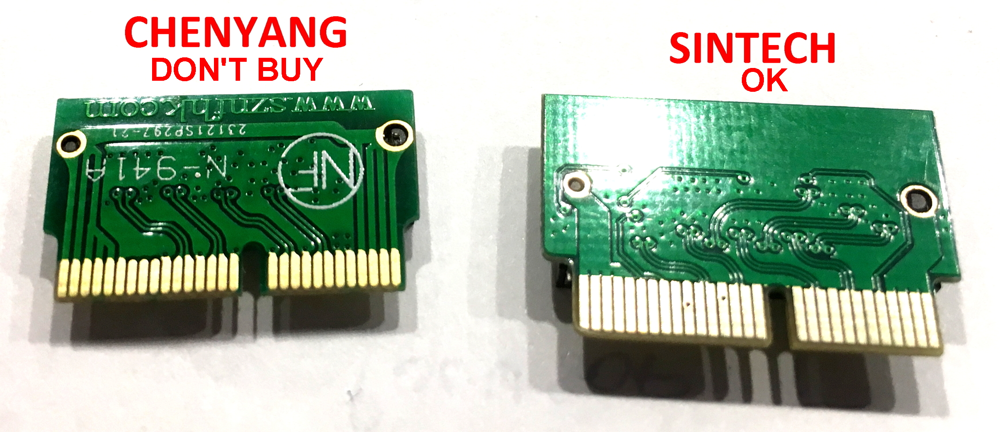
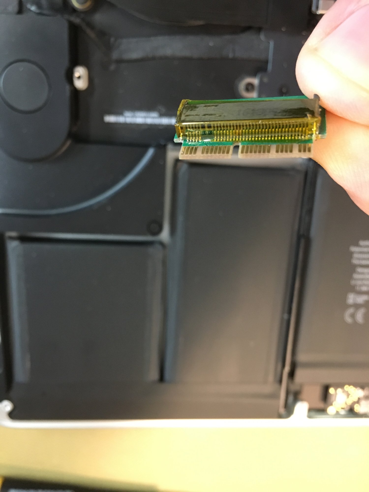

### 老麥書筆記本升級中文指南

全篇譯自[Upgrading 2013/2014 Macbook Pro SSD to M.2 NVMe](https://forums.macrumors.com/threads/upgrading-2013-2014-macbook-pro-ssd-to-m-2-nvme.2034976/ "Upgrading 2013/2014 Macbook Pro SSD to M.2 NVMe")

# 前言
這是一篇將你的老麥書筆記本(MacBook Airs & Macbook Pros **2013-2015** )升級或替換高速度與高容量的**NVMe SSD**該注意的事項得討論串，原文由討論區[macrumors](https://forums.macrumors.com "macrumors")
的用戶*maxthackray*發起。

# 背景，為什麼升級到NVMe ?
在2013-2017年間，蘋果出貨的筆記本默認撘載特規接口(稱之**gumstick connector 腳位12+16 pins**)的AHCI 刀鋒(**blade**) SSD，它們擁有2通道 PCIe 2.0 (2013) 或 4通道 PCIe的速度，主要製造商為 Toshiba 或 Samsung。

在當時要將這些出產的SSD升級或替換只能透過已下方式：

1. 蘋果原廠品(可由第三方購得一般為拆機品，價格昂貴)
2. OWC (Aura Pro, Aura Pro 2) 或 Transcend (820, 850) 系列SSD
3. 自己動手DIY，買M.2 AHCI SSD跟一個轉接頭

但PCIe M.2 AHCI SSD已停產，也買不到新的，就算有也是二手昂貴並沒有保修(warranty)。

在其間NVMe 刀鋒(**blade**) M.2 SSD 在市場上越來越多，品牌如雨後春筍冒出，價格便宜，速度更快也更可靠，容量小至大，可達4TB。

為何不選擇NVMe?
有兩個前提:

1. 韌體必須支援
2. 操作系統也要支援

所幸，在2017年，推出macOS 10.13 (High Sierra)，不僅支援多層存儲架構的NVMe SSD，也能透過升級固件(BootRom )開啟開機啟動

對了， macOS 10.14 Mojave也是如此

到此萬事俱備，我們可以升級2013-2017 MacBook筆記本了，不再使用貴，二手，沒保固的AHCI SSD，而是全新，更便宜，保修更可長達5年(依廠商規定)的NVMe SSD

這份升級中文指南可以指導您一些升級的方向

# 哪些 Mac筆記本可以升級至NVMe SSD?
1. 所有MacBook Air 機型 從 Mid 2013 到 2017 (MacBookAir6,1 to MacBookAir7,1)
2. 所有MacBook Pro 機型 從 Late 2013 到 Mid 2015 (MacBookPro11,1 to MacBookPro12,1)

## Macbook Air細節說明

2013-2014 MacBook Air 機型 原生自帶 2通道 PCIe 2.0 AHCI SSD (速度達 ~700MB/s)。
這些支援達4TB NVMe SSD如果固件升級到至少**MBA61.0103.B00**, 速度規格可以近 PCIe 2.0 4通道 。
但**不支援**原生休眠模式，目前已經有解決方案
機型如下:

1. MacBook Air 11" Mid 2013 (MacBookAir6,1)
2. MacBook Air 13" Mid 2013 (MacBookAir6,2)
3. MacBook Air 11" early 2014 (MacBookAir6,1)
4. MacBook Air 13" early 2014 (MacBookAir6,2)

2015-2017 MBA  機型原生自帶 2通道或 4通道 PCIe 2.0 AHCI SSD (速度 ~700 至 ~1500MB/s)。
這些支援達4TB NVMe SSD如果固件升級到至少**MBA71.0171.B00**, 速度規格可以近 PCIe 2.0 4通道 。
**支援**原生休眠模式
機型如下:

1. MacBook Air 13" early 2015 (MacBookAir7,1)
2. MacBook Air 13" 2017 (MacBookAir7,2)

## MacBook Pro retina 13" and 15"細節說明

2013-2014 MacBookPro retina  機型 原生自帶 2通道 PCIe 2.0 AHCI SSD (速度達 ~700MB/s)。
這些支援達4TB NVMe SSD如果固件升級到至少**MBP111.0142.B00**(13")或**MBP112.0142.B00**(15"), 速度規格可以近 PCIe 2.0 4通道 。
但**不支援**原生休眠模式，目前已經有解決方案
機型如下:

1. MacBook Pro Retina 13" late 2013 (MacBookPro11,1)
2. MacBook Pro Retina 15" late 2013 (MacBookPro11,2 & MacBookPro11,3)
3. MacBook Pro Retina 13" mid 2014 (MacBookPro11,1)
4. MacBook Pro Retina 15" mid 2014 (MacBookPro11,2 & 11,3)

2015 MacBookPro retina 13" and 15" 機型原生自帶  4通道 PCIe 2.0 AHCI SSD (速度達 ~1400MB/s)。
這些支援達4TB NVMe SSD 如果固件升級到至少 **MBP121.0171.B00** (  13" 機型) 或 **MBP114.0177.B00** (  15" 機型)。
機型Retina **15"** mid 2015 支援 4通道 PCIe 3.0 速度達3000MB/s。
機型 early 2015 Retina **13"**  支援 4通道 PCIe 2.0 速度
**支援**原生休眠模式
機型如下:
1. MacBook Pro Retina 13" early 2015 (MacBookPro12,1)
2. MacBook Pro Retina 15" mid 2015 (MacBookPro11,4-11,5)

# 哪些 Mac筆記本不支援升級至NVMe SSD?
2013之前的版本

1. 所有 非 retina MacBook models (MacBook1,1 to MacBook7,1)
2. 所有 非  retina MacBook Pro (MacBookPro1,1 to MacBookPro9,2)

這些版本帶有2.5" SATA 接口，你可以替換任意符合2,5" SATA AHCI SSD
這些版本中有兩種機型需要注意

1. MacBook Air from Late 2010至 Mid 2012 (MacBookAir 3,1 to MacBookAir5,2)
2. MacBook Pro Retina from mid 2012 至 early 2013 (MacBookPro10,1 to MacBookPro11,2)

這些機型帶M.2 AHCI SATA SSD 且使用 SATA接口， 但它們不能相容M.2 PCIe SSD，他們看起來非常相似，但無法相容
這些機型**只能**透過轉接卡(M.2 轉 Apple 6+12 adapters)(gumstick connector)配上任意SATA M.2 AHCI SSD(如Crucial MX500 sata M.2)。Transcend 與 OWC皆有提供銷售方案

 2015之後的版本

1. 所有 MacBook Air since the Retina 2018 (MacBookAir8,1)
2. 所有 MacBook 12" Retina since the early 2015 (MacBook8,1)
3. 所有 MacBook Pro 13" Retina 4 TB ports since 2016 (MacBookPro13,2)
4. 所有 MacBook Pro 15" Retina since 2016 (MacBookPro13,3)

如果你有這些機型，很抱歉他們無法升級，它們的儲存裝置是焊接在主機板上的

唯一的例外是MacBook Pro 13" Retina with 2TB (2016-2017)自帶 PCIe 3.0 NVMe SSDs，可能日後會有帶轉接卡的解決方案(目前廠商Sintech 已經在做)

# 哪些  NVMe SSDs 可以使用?
基本上所有的NVMe SSD都可以運作除了少數不相容的固件版本
下面是經過測試可以正常運作的品牌與型號

-     Adata NVMe SSD : SX6000, SX7000, SX8200, SX8200 Pro etc.
-     Corsair NVMe SSD : MP500, MP510
-     Crucial NVMe SSD : P1
-     HP NVMe SSD : ex900, ex920, ex950
-     OCZ RD400
-     Toshiba XG3, XG4, XG5, XG5p, XG6
-     Intel NVMe SSD : 600p, 660p, 760p
-     MyDigital NVMe SSDs : SBX - BPX
-     Kingston NVMe SSD : A1000, A2000, KC1000
-     Sabrent Rocket (Phison E12 and E16 based)
-     Samsung NVMe SSD : 960 Evo, 960 Pro, 970 Evo, 970 Pro, 970 Evo plus (with latest firmware)
-     WD Black NVMe SSD v1, v2 and v3, WD Blue SN550
-     Inland Premium (not Professional)

已下已知有問題，請勿使用

-     Samsung PM981
-     Samsung 950 Pro

有問題的SSD 可能是因為固件(firmware )問題

## 我還有其他選擇嗎?

可以使用 AHCI (貴/沒保固/缺點多)

-     Apple SSUAX and SSUBX OEM blades (貴/二手/沒保)
-     OWC Aura SSD : 2x 通道, RAID0 of 2x slow controllers, 沒有 TRIM, 沒有 SMART
-     Transcend Jetdrive 820 : 2x 通道, 貴

使用Apple 原生接口(gumstick connector)的NVMe 

-     Apple "Polaris" NVMe SSDs : 很快但貴
-     OWC Aura Pro X : 不便宜 與其他NVMe比較速度不算快
-     Transcend JetDrive 850/855 : 不便宜 與其他NVMe比較速度不算快

## 還有一些要知道的事

-     所有 NVMe M.2裝置 原生支援TRIM
-     NVMe 裝置格式化過程 512b sectors 小於 10.13無法工作
-     NVMe 裝置格式化過程 4K sector size (如Sabrent Rocket) 在macOS 10.12可以正常對齊, 請更新BootRom到最近的版本

# gumstick轉接器的真與假

Apple 用了自家特規的接口，而其他廠商採用常見的M.2 接口
所以要升級，你必須要有轉接卡
已經經過測試的廠商為 **Sintech**
您可能會看到其他的品牌**Chenyang** 或 **CableCC**但可能有許多的問題會讓你的NVMe SSD無法正常運作，如開機，或休眠
如果可以請使用Sintech
Sintech 提供了三種版本的轉接卡(rev. A rev. B and rev. C)
rev. A 會出現問題，但從2019起基本上，所有出貨的轉接卡都可以完美運作

您可以從下面官網中買到
http://eshop.sintech.cn/ngff-m2-pcie-ssd-card-as-2013-2014-2015-macbook-ssd-p-1139.html
或者選擇Amazon 賣場
https://www.amazon.com/Sintech-Adapter-Upgrade-2013-2016-2013-2015/dp/B07FYY3H5F/
或者你熟悉的商城選購Sintech轉卡

如果是在2017-2018年製造的Sintech轉卡請與下圖比較進行確認

# 修復休眠問題

在2013-2014版本機型上包含MacBook Pro retina 13" & 15", 與 MacBook Air 11" & 13"因 為BootRom固件驅動(DXE NVMe Driver)缺陷導致休眠喚起時產生問題。
這問題發生在**所有NVMe類型的 SSD**上，甚至Apple NVMe SSDs, 甚至 OWC aura Pro 2, 甚至 Transcend 850 NVMe SSDs...等

這問題在於2013-2014 MacBooks的固件驅動(DXE NVMe Driver)缺陷

有幾個解決方案
1. 使用下面命令停止(disable )休眠功能
`sudo pmset -a hibernatemode 0 standby 0 autopoweroff 0`

2. 幫固件打上補丁
補丁下載
https://forums.macrumors.com/threads/upgrading-2013-2014-macbook-pro-ssd-to-m-2-nvme.2034976/page-65#post-26224320

3. 使用MattCard
http://www.cmizapper.com/products/mattcard.html

方案一不是解決之道。缺少休眠可能使你的筆記本續航力一夜之間掉了10%

方案二有風險並且需要SPI來寫入補丁

方案三，使用MattCard，這是一個適合的方案
MattCard有自己的ROM，可以接管主板上的，當然它也能隨時拔除，然後恢復到主板的ROM，也就是沒修改沒打過補丁的狀態。

# BootCamp安裝問題

在做BootCamp安裝Windows 10 前請先做好完整的備份。

安裝過程會產生**藍畫面(blue screen )**
如果產生錯誤藍畫面(blue screen ) 時
使用下列步驟來解決:

1.  按下 Shift + F10 keys.
2.  啟動 登錄程式**regedit**
3.  找到下列登錄路徑, **HKEY_LOCAL_MACHINE\SYSTEM\Setup\Status\ChildCompletion**
4. 右方找到 **setup.exe** , 雙擊改變 value 為 3
5. 關閉regedit
6.  重啟

安裝過程也請將電源插頭插上，勿依靠電池來完成全部安裝過程

## 其他安裝問題How to fix a drive partition failure while installing Windows through Boot Camp in High Sierra
https://appleinsider.com/articles/18/01/29/how-to-fix-a-drive-partition-failure-while-installing-windows-through-boot-camp-in-high-sierra

## An error occurred while partitioning the disk" in Mojave Boot Camp Assistant
因為硬碟overallocation造成，若產生問題你可能在畫面上看到fix overallocation
修復步驟:

1. 關閉Mac.
2. 重啟按住 **Cmd-S** 到單一用戶模式.
3. 鍵入  **fsck_apfs -oy /dev/disk0s2**
4. 確認 後需要約3分鐘時間
5. 鍵入 **reboot** 重啟.
